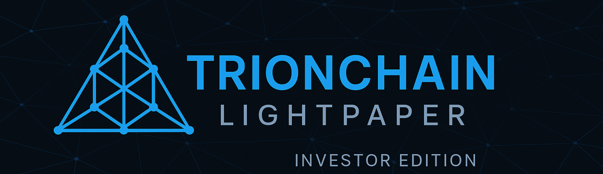

  

  
  
  
  

---

# 🌐 TrionChain Lightpaper  
### Institutional & Investor Edition  
**Version 1.0 – 2025**  
**TrionChain Foundation**

---

## 📚 Table of Contents
- [Overview](#-overview)
- [Executive Summary](#-executive-summary)
- [The Problem](#-the-problem)
- [The TrionChain Solution](#-the-trionchain-solution)
- [Trion-Cells](#-trion-cells)
- [RWA Framework](#-rwa-framework)
- [Use Cases](#-use-cases)
- [TON Token](#-ton-token)
- [Governance](#-governance)
- [Roadmap](#-roadmap)
- [Vision](#-vision)
- [Contact](#-contact)

---

## 📘 Overview

This repository hosts the **official Lightpaper** of **TrionChain**, a next-generation blockchain protocol inspired by the **Finite Element Method (FEM)** and designed for **Real-World Assets (RWA)**, institutional infrastructure, and large-scale multi-domain systems.

The Lightpaper provides a high-level, investor-friendly explanation of:

- The TrionChain architecture  
- The FEM-based computation model  
- Regionalized Trion-Cells  
- RWA and institutional integrations  
- Token economy  
- Governance  
- Roadmap  
- Vision  

For the full technical whitepaper and protocol documentation:  
👉 https://github.com/TrionChainFoundation/trionchain-whitepaper

---

## 📌 Executive Summary

TrionChain is built for the real-world economy, enabling scalable, deterministic, regionalized blockchain computation. With a design modeled after **FEM engineering simulations**, TrionChain introduces **Trion-Cells**—regional computation zones with local finality and global consistency.

Designed for:
- Governments  
- Banks and institutional funds  
- Energy and mining companies  
- Agriculture and logistics sectors  
- High-performance Web3 ecosystems  

TrionChain brings blockchain to real infrastructures.

---

## 🚧 The Problem

Traditional blockchains are:

- **Monolithic** → single global execution layer  
- **Non-regional** → no spatial structure  
- **Difficult for institutions** → compliance & governance limitations  

Real infrastructures (energy grids, mining concessions, land plots, logistics routes) **are regional by nature**. Blockchain must match this reality.

---

## 🧩 The TrionChain Solution

### FEM-Inspired Architecture  
TrionChain adapts the Finite Element Method:

- Global domain → global blockchain  
- Elements → Trion-Cells  
- Boundaries → cross-cell constraints  
- Assembly → global consensus  

### Multi-Layer Hybrid PoS  
Security occurs on:

1. Local cell consensus  
2. Boundary synchronization  
3. Global PoS finality  

This architecture enables extreme scalability, deterministic behavior, and institutional alignment.

---

## 🌀 Trion-Cells

Each **Trion-Cell** is a regional mini-blockchain with:

- Local validation  
- Local gas market  
- Local state  
- Local RWA registry  
- Local governance  

Cells naturally represent:

- Mining blocks  
- Energy networks  
- Agricultural districts  
- Cities or regions  
- Logistic corridors  

Perfect for regulated real-world systems.

---

## 🌍 RWA Framework

TrionChain includes:

- **RWA Objects**  
- **Institutional oracles**  
- **Regulatory metadata**  
- **Audit trails**  
- **Compliance modules**  

Supports:

- Energy assets  
- Mining commodities  
- Land & agriculture  
- Logistics & supply chain  
- Carbon credits  
- Tokenized portfolios  

---

## 🧠 Use Cases

- Energy production, balancing & ESG  
- Mining concession tokenization  
- Agriculture land lots & traceability  
- Logistics route validation  
- Financial infrastructure for RWAs  

---

## 💠 TON Token

Utility:

- Gas  
- Staking  
- Slashing  
- Validator rewards  
- Governance  
- RWA operations  

Features:

- Sustainable economics  
- Fee-burning  
- Layered incentivization  
- Institutional-grade stability  

---

## 🏛 Governance

Three layers:

1. **Global** – protocol-wide decisions  
2. **Regional** – Trion-Cell governance  
3. **Institutional** – RWA issuers & compliance layers  

---

## 🗺 Roadmap

### Phase 0 — Research  
Architecture defined. ✔  

### Phase 1 — Documentation  
Whitepaper + repos. *(Current)*  

### Phase 2 — Prototype  
FEM engine + Trion-Cell execution.  

### Phase 3 — Internal Testnet  
Multi-cell environment.  

### Phase 4 — Public Testnet  
RWA sandbox + institutional onboarding.  

### Phase 5 — Mainnet  
TON token + governance + modules.  

### Phase 6 — Global Adoption  
Governments, banks & infrastructure providers.  

---

## 🔭 Vision

TrionChain is the **computational substrate for real-world systems**, converging engineering-grade modeling with decentralized infrastructure.

Not just a blockchain —  
a **real-economy operating system**.

---

## 📬 Contact

- **Foundation:** TrionChain Foundation  
- **Email:** foundation@trionchain.org  
- **Website:** https://trionchain.org  
- **GitHub:** https://github.com/TrionChainFoundation  
- **Whitepaper:** https://github.com/TrionChainFoundation/trionchain-whitepaper  

---

<strong>© 2025 TrionChain Foundation — All Rights Reserved.</strong>

